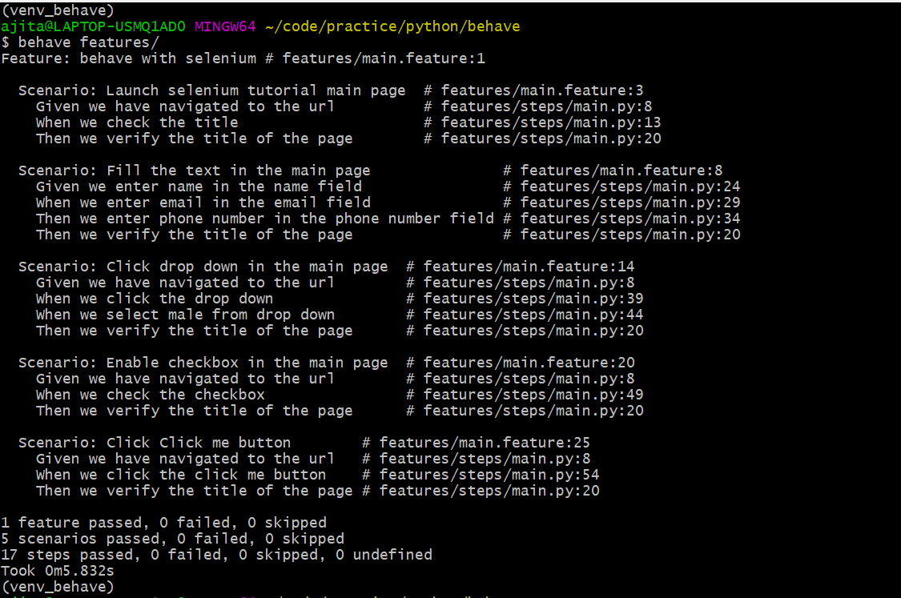

## Download the driver
- Download Geckodriver (https://github.com/mozilla/geckodriver/releases) and add it to your PATH environment variable
- Download Chromedriver (https://sites.google.com/chromium.org/driver/) and add it to your PATH environment variable

## Install Python
- https://www.python.org/downloads/

## Create Virtual enviornment
- source virtualenv <virtual_enviornment_name>
- Once created, activate it

## Run Tests
- Navigate to root dir and run the following:

        behave feature/

## Test Output

